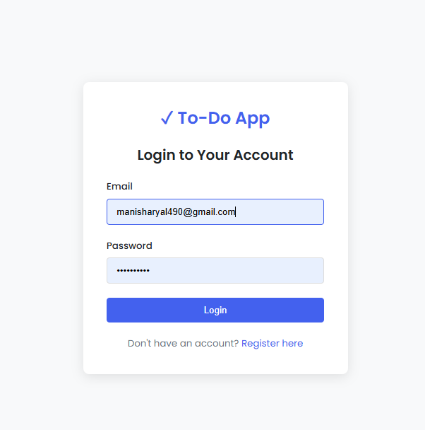
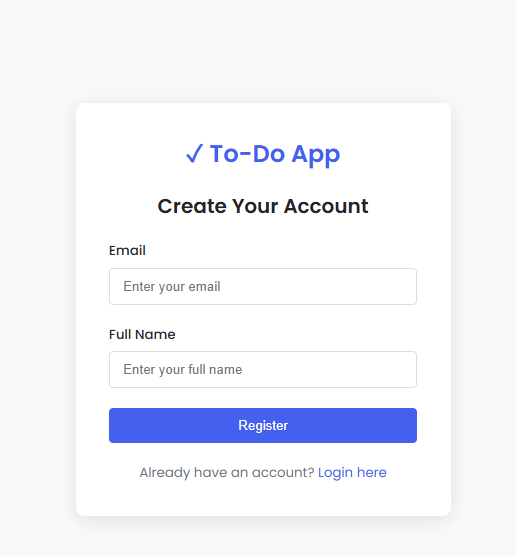
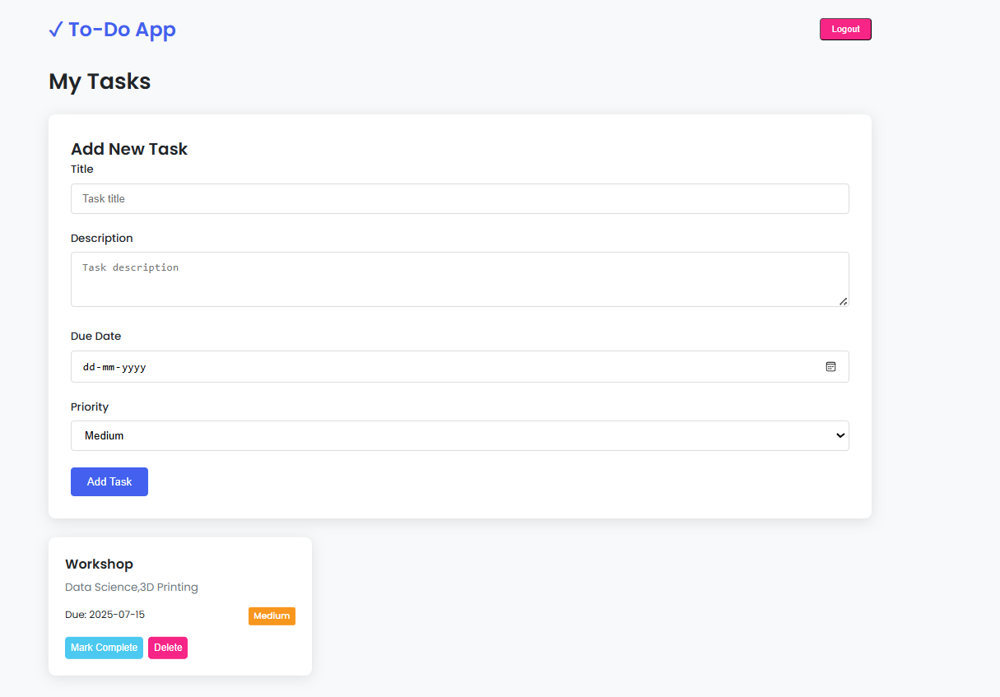
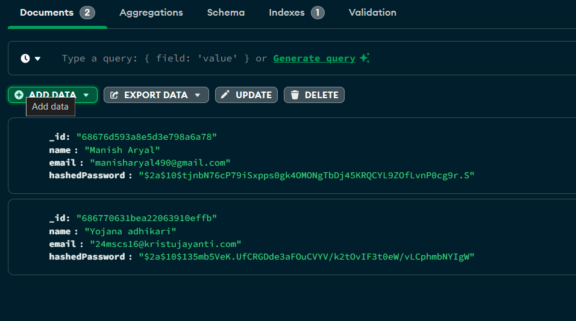
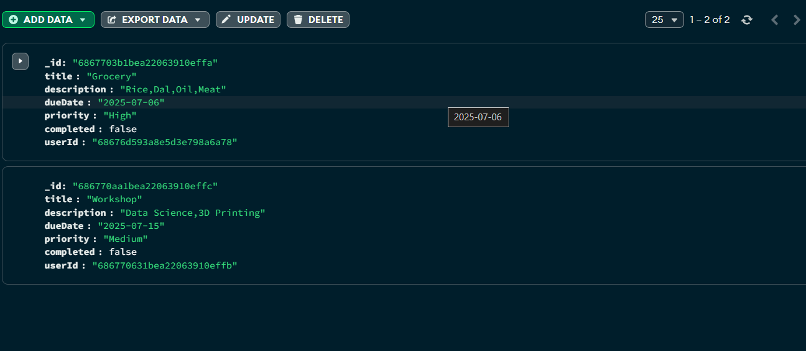

# 📝 To-Do List Application

A secure, scalable Java-based To-Do List application with **MongoDB**, **JWT-based authentication**, **Redis token management**, and **asynchronous email notifications**, built using **Vert.X**.

  
*Figure 1: Landing page with registration and login options*

---

## 🚀 Features

- 🔐 Secure user authentication using JWT and Redis
- ✉️ Asynchronous email notifications (registration, password reset, reminders)
- 📝 Full CRUD operations for to-do tasks
- 🔄 Token refresh mechanism for session management
- ⏰ Task reminders sent via email
- 📊 Paginated, filterable, and sortable task views


## 📸 Screenshots

### 🔐 Registration Page
  
*Figure 2: User registration screen*

### 📋 Task Management
  
*Figure 3: Add or edit tasks*

### 🗃️ MongoDB Collections
  
  
*Figure 4: MongoDB document structure for users and tasks*

---

### ✅ Prerequisites

- Java 17+
- MongoDB 5.0+
- Redis 6.0+
- SMTP credentials (or [MailHog](https://github.com/mailhog/MailHog) for local testing)

---

### 📦 Installation

```bash
git clone https://github.com/manisharyal2001/To-Do-List.git
cd To-Do-List
