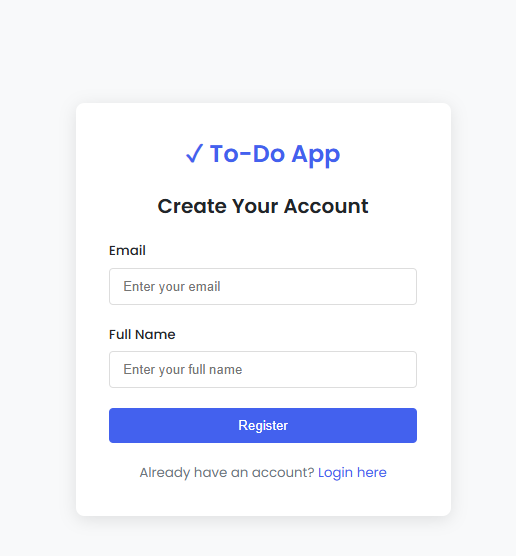

# To-Do List Application

A secure, scalable Java-based To-Do List application built with MongoDB, JWT authentication, Redis for token management, and asynchronous email delivery.


*Figure 1: Landing page with registration and login options*

---

## Features

- 🔐 **Secure user authentication** with JWT and Redis token storage
- ✉️ **Asynchronous email delivery** for registration and password reset
- 📝 **Full CRUD operations** for to-do tasks
- 🔄 **Token refresh mechanism**
- ⏰ **Task reminders** with email notifications
- 📊 **Paginated, filterable, and sortable task views**

---

## 🛠 Tech Stack

- **Backend:** Java (Spring Boot)
- **Database:** MongoDB
- **Authentication:** JWT with Redis storage
- **Email:** Spring Mail with async processing
- **API:** RESTful design

---

*Figure 2: Registration for new users*

---

*Figure 2: Edit existing task or add new task*

---


---


*Figure 3: MongoDB document structure for users and tasks*

---

##  Getting Started

###  Prerequisites

- Java 17+
- MongoDB 5.0+
- Redis 6.0+
- SMTP server credentials (or [MailHog](https://github.com/mailhog/MailHog) for local development)

###  Installation

Clone the repository:

```bash
git clone https://github.com/yourusername/todo-list-app.git
cd todo-list-app
Copy and configure application properties:

bash
Copy
Edit
cp src/main/resources/application.example.properties src/main/resources/application.properties
Edit the file with your MongoDB, Redis, and SMTP credentials.

Build and run the application:

bash
Copy
Edit
./mvnw spring-boot:run
🖼 Application Screens

Figure 3: User registration screen


Figure 4: User login screen


Figure 5: Task creation and management interface

API Documentation
Authentication
Endpoint	Method	Description
/api/auth/register	POST	Register new user
/api/auth/login	POST	Login and get JWT
/api/auth/refresh	POST	Refresh JWT token
/api/auth/logout	POST	Invalidate JWT
/api/auth/password-reset	POST	Initiate password reset
/api/auth/password-reset/confirm	POST	Complete password reset

📝 Tasks
Endpoint	Method	Description
/api/tasks	GET	Get paginated tasks
/api/tasks	POST	Create new task
/api/tasks/{id}	GET	Get task by ID
/api/tasks/{id}	PUT	Update task
/api/tasks/{id}	DELETE	Delete task
/api/tasks/{id}/complete	PATCH	Mark task as complete
/api/tasks/{id}/incomplete	PATCH	Mark task as incomplete


Figure 6: Sample task data structure in MongoDB

Configuration
Edit src/main/resources/application.properties:

properties
Copy
Edit
# MongoDB
spring.data.mongodb.uri=mongodb://localhost:27017/tododb

# Redis
spring.redis.host=localhost
spring.redis.port=6379

# JWT
jwt.secret=your-secret-key
jwt.expiration.ms=86400000 # 24 hours

# Email
spring.mail.host=smtp.example.com
spring.mail.port=587
spring.mail.username=user@example.com
spring.mail.password=password
 Running Tests
bash
Copy
Edit
./mvnw test
 Deployment
Build the JAR:

bash
Copy
Edit
./mvnw clean package
Run with production profile:

bash
Copy
Edit
java -jar target/todo-list-app.jar --spring.profiles.active=prod
 Contributing
Pull requests are welcome. For major changes, please open an issue first to discuss what you would like to change.

 License
This project is licensed under the MIT License.

